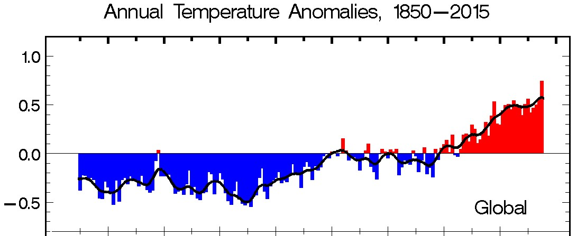
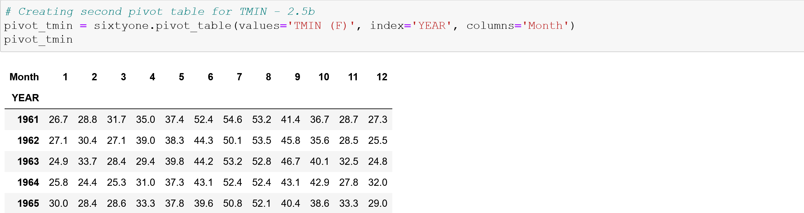
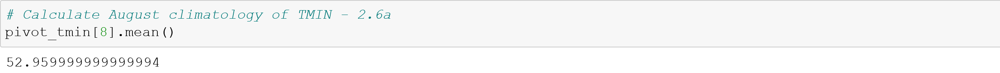
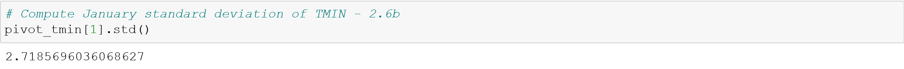
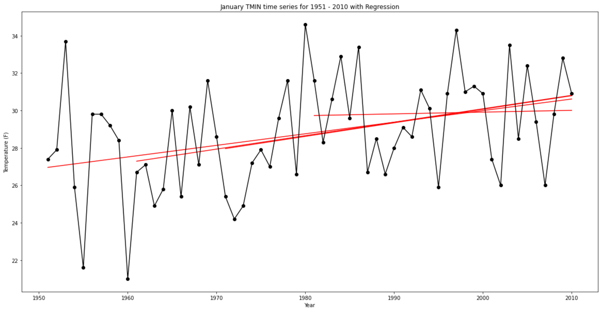

# cuyamaca-climatology-analysis

This project was an analysis of three different datasets that all were long term time series of Global Annual Temperature Anomalies.  The three datasets were from:

- National Centers for Environmental Information (NCEI) which is part of the National Oceanic and Atmospheric Administration (NOAA).  The first and third dataset were from NCEI.  
- Carbon Dioxide Information Analysis Center (CDIAC).  The second dataset was from CDIAC.  Investigators - P.D. Jones, et al.  

The first dataset from NCEI was data from Cuyamaca, CA (Station No. 042239) covering the years 1887 to 2014.  The requirements were to:

- Arrange the monthly Cuyamaca Tmax, Tmin and Tmean data from January 1961 to December 1990 into a DataFrame.

- Calculate the August climatology of Tmax, Tmin and Tmean for that time period.  

- Compute standard deviation of Tmax, Tmin and Tmean for that time period.  

- Plot the Cuyamaca January Tmin time series from 1951 to 2010
- Plot regression trend lines of Tmin on the same plot for the following time periods:
  - 1951 to 2010
  - 1961 to 2010
  - 1971 to 2010
  - 1981 to 2010

